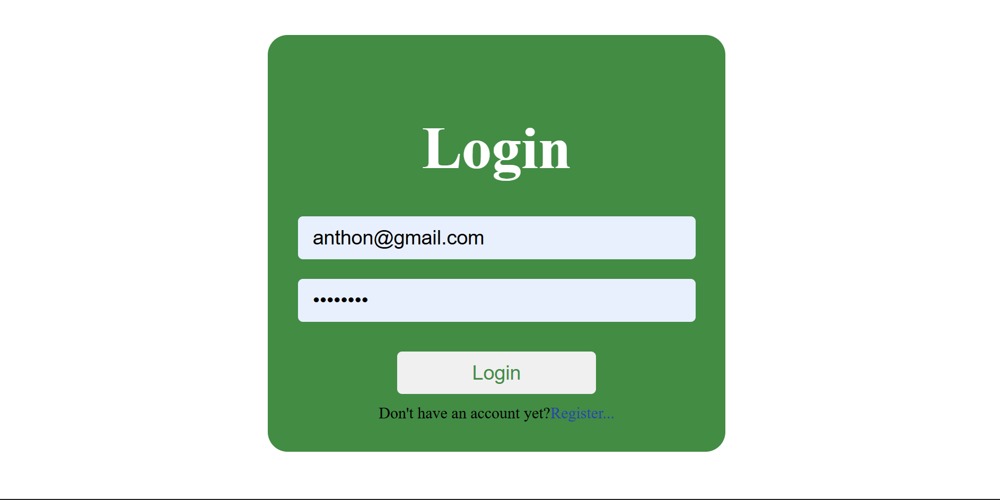
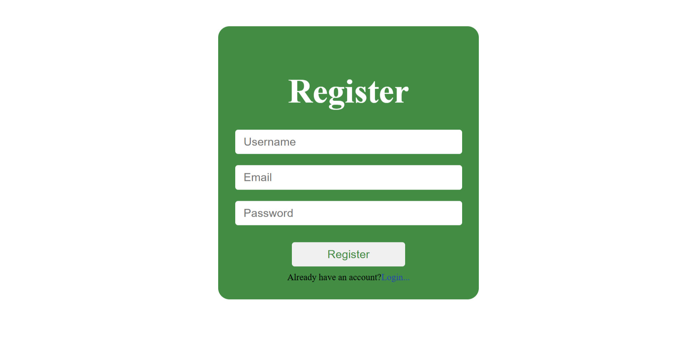
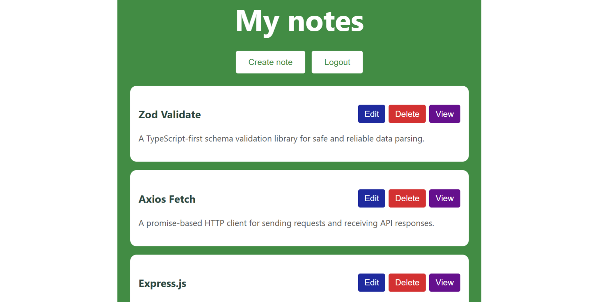
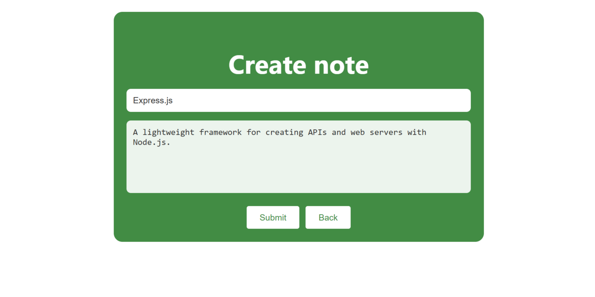
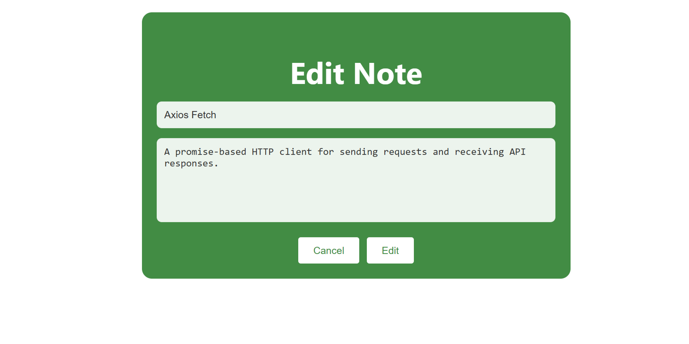
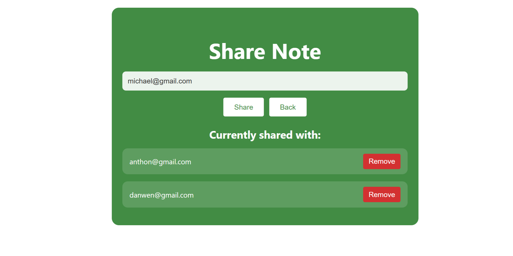
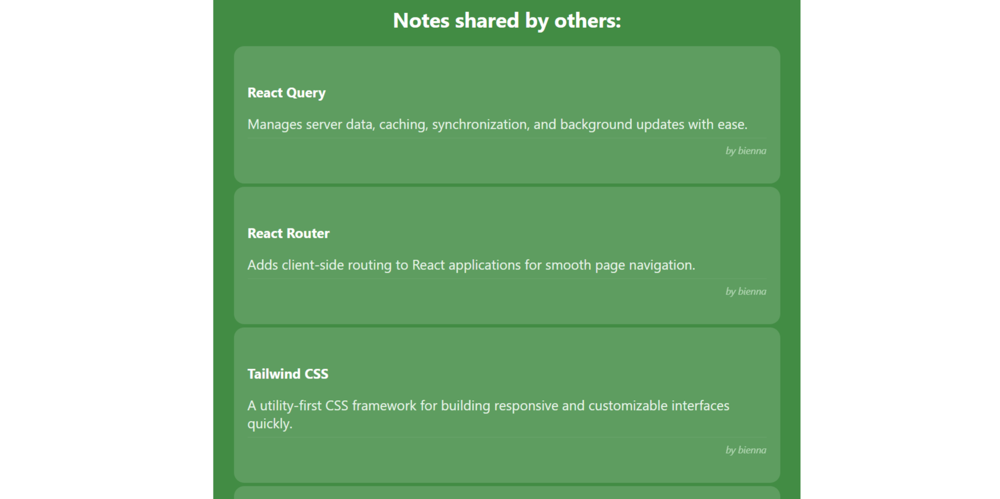

# 📝 Shareable Notes App

This is my first serious project, a simple but handy notes app I built from scratch. You can jot down notes, come back later to edit them, and organize things however you like. The cool part is you can share any note with other people on the app just by entering their email, and you'll also get a feed of notes that others have decided to share with you.

## 💡 What I Learned

- Basic CRUD operations (create, read, update, delete) for managing notes
- TypeScript fundamentals across both frontend and backend
- Many-to-many relationships in PostgreSQL for the note sharing system
- Basic CSS styling to build a clean and responsive UI
- Handling multiple users with authentication, protected routes, and per-user data
- JWT authentication with HTTP-only cookies for secure sessions
- Input validation using Zod on the backend
- Building RESTful APIs with Express

## 🛠️ Tech Stack

**Frontend:** React, TypeScript, Vite, React Router, Axios

**Backend:** Node.js, Express, TypeScript, PostgreSQL, JWT, bcrypt, Zod

## 🚀 Setup Instructions

### Prerequisites

Make sure you have these installed on your machine:
- [Node.js](https://nodejs.org/)
- [PostgreSQL](https://www.postgresql.org/download/)

### 1. Clone the Project

```bash
git clone https://github.com/anthon-louise/shareable-note-app.git
cd shareable-note-app
```

### 2. Set Up the Database

Open your PostgreSQL terminal or pgAdmin and run this SQL to create the database and tables:

```sql
CREATE DATABASE "shareable-notes";

CREATE TABLE users (
    id SERIAL PRIMARY KEY,
    username VARCHAR(50) NOT NULL,
    email VARCHAR(50) NOT NULL UNIQUE,
    password_hash TEXT NOT NULL,
    created_at TIMESTAMP DEFAULT CURRENT_TIMESTAMP
);

CREATE TABLE notes (
    id SERIAL PRIMARY KEY,
    user_id INTEGER NOT NULL REFERENCES users(id) ON DELETE CASCADE,
    title VARCHAR(50) NOT NULL,
    content TEXT NOT NULL,
    created_at TIMESTAMP DEFAULT CURRENT_TIMESTAMP,
    updated_at TIMESTAMP DEFAULT CURRENT_TIMESTAMP
);

CREATE TABLE note_shares (
    id SERIAL PRIMARY KEY,
    note_id INTEGER NOT NULL REFERENCES notes(id) ON DELETE CASCADE,
    shared_with_user_id INTEGER NOT NULL REFERENCES users(id) ON DELETE CASCADE,
    created_at TIMESTAMP DEFAULT CURRENT_TIMESTAMP,
    UNIQUE (note_id, shared_with_user_id)
);
```

### 3. Configure Environment Variables

Inside the `backend` folder, create a `.env` file and fill in your details:

> ⚠️ **Important:** Make sure to set your own PostgreSQL password in `DB_PASSWORD` and choose a secure value for `SECRET`.

```env
PORT=5000
DB_HOST=localhost
DB_PORT=5432
DB_USER=postgres
DB_PASSWORD=your_postgres_password_here
DB_NAME=shareable-notes
SECRET=your_jwt_secret_here
```

### 4. Install Dependencies

Open two terminals. In the first one:

```bash
cd backend
npm install
```

In the second terminal:

```bash
cd frontend
npm install
```

### 5. Start the App

In the backend terminal:

```bash
npm run dev
```

In the frontend terminal:

```bash
npm run dev
```

### 6. Open the App

Go to [http://localhost:5173](http://localhost:5173) in your browser. Register an account and you're good to go.

## 📡 API Endpoints

### Users
- `POST /api/users/register` — Create a new account
- `POST /api/users/login` — Log into your account
- `GET /api/users/me` — Get the currently logged in user
- `POST /api/users/logout` — Log out and clear the session

### Notes
- `GET /api/notes` — Get all your personal notes
- `POST /api/notes` — Create a new note
- `GET /api/notes/:id` — Get a specific note by ID
- `PUT /api/notes/:id` — Edit a note
- `DELETE /api/notes/:id` — Delete a note

### Sharing
- `POST /api/notes/:id/share` — Share a note with another user by email
- `DELETE /api/notes/:id/share/:userId` — Remove someone's access to a shared note
- `GET /api/notes/:id/shares` — See who you've shared a note with
- `GET /api/notes/sharedwithme` — See all notes others have shared with you

## 📸 Screenshots














